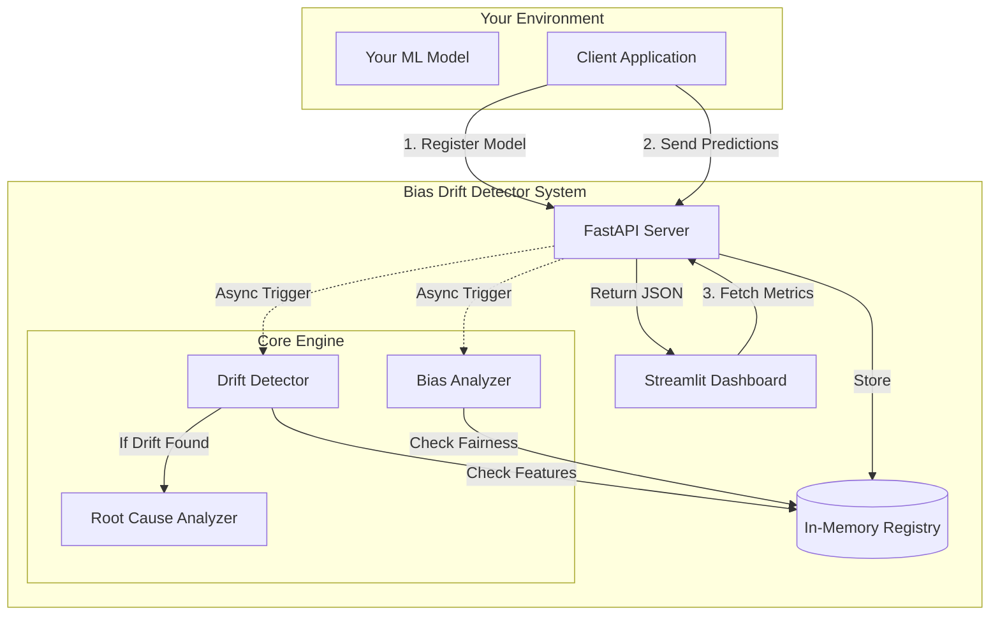

# Project Overview: Ethical AI Bias Drift Detector

## 1. What is this project?
This is an **Ethical AI Bias Drift Detector System**. It is a monitoring tool designed to sit alongside your deployed Machine Learning models. It acts as a "Guardian," continuously checking two critical health metrics:
1.  **Drift**: Is the incoming data significantly different from what the model was trained on? (e.g., "Age" distribution shifting).
2.  **Bias**: Is the model treating different groups fairly? (e.g., Are approval rates for "Male" vs "Female" applicants equal?).

## 2. Why do we need it?
ML models degrade over time.
- **Data Drift** leads to lower accuracy.
- **Bias** leads to unethical or illegal decisions (e.g., denying loans based on race).
- **Root Cause Analysis** is needed to quickly fix these issues.

## 3. How does it work? (Flowchart)



## 4. Current Capabilities vs. Your Request

You asked about advanced features. Here is the current status of the MVP (Minimum Viable Product):

| Feature | Status | Description |
| :--- | :--- | :--- |
| **Drift Detection** | ✅ **Done** | Uses KS Test, PSI, and Chi-square to detect feature shifts. |
| **Bias Analysis** | ✅ **Done** | Uses Fairlearn metrics (Disparate Impact, Demographic Parity). |
| **Root Cause Tracing** | ⚠️ **Partial** | Implemented SHAP-based feature importance drift. |
| **Counterfactuals** | ❌ **Not Started** | DiCE integration is planned but not yet implemented. |
| **LLM Reports** | ❌ **Not Started** | Automated narrative reports using LLMs are not yet linked. |
| **Auto-PR Fixes** | ❌ **Not Started** | Automated code fixing is a complex agentic workflow not yet built. |
| **Grafana Integration** | ❌ **Not Started** | Current dashboard is Streamlit. Grafana requires a Prometheus exporter. |

## 5. How to Test on German Credit Data
We created and verified `examples/german_credit_demo.py`.
**Results from Test Run:**
- **Drift Detected**: `age` (Score=0.26), `employment`, `job`, `own_telephone`.
- **Fairness Score**: 40/100 (Indicates significant bias or disparity).
- **Simulation**: Successfully perturbed data with noise and age shift.

To run this test yourself:
```bash
python examples/german_credit_demo.py
```

## 6. How to Onboard a New Model (Step-by-Step)

1.  **Prepare Baseline Data**: You need a pandas DataFrame of the data your model was trained on.
2.  **Identify Schema**:
    *   `numerical_features`: List of continuous columns (e.g., Age, Amount).
    *   `categorical_features`: List of discrete columns (e.g., Purpose, Housing).
    *   `sensitive_attributes`: List of columns to check for bias (e.g., Sex, AgeGroup).
3.  **Register**:
    *   Send a POST request to `/api/v1/models/register`.
    *   Payload must include the schema and the baseline data (converted to list of dicts).
4.  **Log Live Data**:
    *   Instrument your inference code to send a POST request to `/api/v1/predictions/log` for every prediction.
    *   Include `features` and `prediction`.
    *   Include `true_label` if you have it (for accuracy monitoring).
